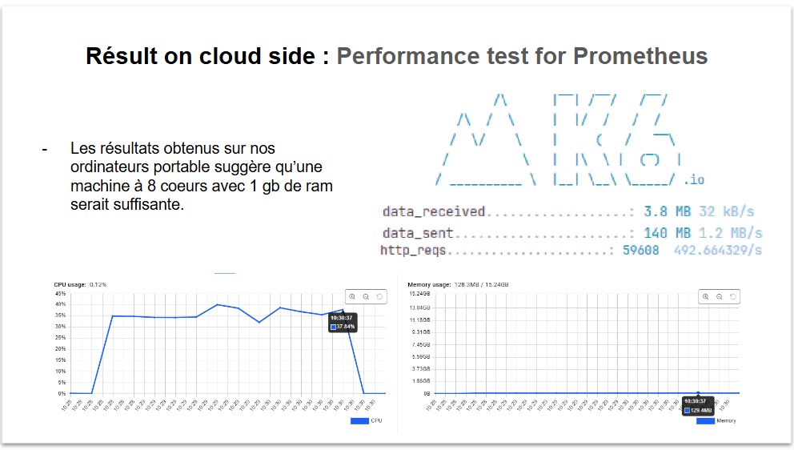

## Validation de l'Architecture

L'architecture de notre système a été soigneusement conçue afin de répondre aux besoins de performance et de résilience,
tout en optimisant les ressources. Les résultats des analyses démontrent que notre architecture est capable de gérer 
efficacement le trafic et les données en s’appuyant sur des composants robustes comme le broker de messages RabbitMQ 
et en tirant parti de plateformes matérielles telles que le Raspberry Pi.

### 1. Gestion Efficiente des Données et du Trafic

Comme le montre le figure ci-dessus , le volume de données et de trafic généré par notre application n'est pas excessif. 
Cette caractéristique nous permet de déployer notre application sur des plateformes matérielles à faible consommation 
et coût réduit, comme le Raspberry Pi 4 avec 8 Go de RAM. Cela prouve que notre système est conçu de manière optimisée 
pour des environnements où les ressources sont limitées, ce qui ouvre la voie à des déploiements économiques et éco-responsables.

### 2. Résilience et Gestion des Incidents avec RabbitMQ

L’utilisation de RabbitMQ comme broker de messages renforce la résilience de notre système. En cas d’incident ou de 
coupure de connexion, RabbitMQ stocke les messages jusqu'à la reprise de la connexion. Durant cette période, les messages
peuvent être publiés sans acquittement, permettant ainsi d’assurer une continuité de service. Cette stratégie
permet d’éviter toute perte de données durant les périodes d’indisponibilité temporaire du réseau, garantissant ainsi une 
fiabilité accrue dans la transmission des messages critiques.

### 3. Analyse

La deuxième capture met en évidence les statistiques de performance et d’usage, ce qui nous a permis d'évaluer la stabilité 
et l'efficacité de l’architecture en conditions réelles. L'analyse de ces données confirme que l’architecture répond bien aux attentes. 
Protocol :
    - Détermination d'une requête envoyé par le système de gateway par batch de 50 mesures
    - Envoi des batchs avec un nombre d'utilisateurs importants (ici 500 utilisateurs)
    
K6 permet de simuler des utilisateurs virtuels et de récupérer des métriques de durée des transactions.

### Conclusion

En conclusion, notre architecture est bien adaptée aux besoins de l’application, en équilibrant performance, résilience 
et coût. La possibilité de déployer l’application sur des appareils modestes comme le Raspberry Pi 4 réduit les contraintes 
matérielles et permet une implantation économique. De plus, la gestion robuste des incidents avec RabbitMQ garantit que 
les données ne sont pas perdues en cas de défaillance réseau, renforçant ainsi la fiabilité globale du système.
