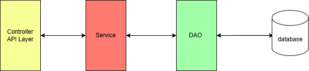

# Architecture pour les Microservices

Nous avons choisi une architecture avec un découpage micro-services pour sa capacité à structurer notre système de manière
modulaire et évolutive. En organisant nos composants en services indépendants, chacun dédié à une fonction métier
spécifique, nous pouvons développer, déployer et maintenir chaque service de manière autonome. Cette approche facilite
la réutilisabilité des services, améliore leur maintenabilité et permet une meilleure adaptabilité aux changements des
besoins métier. Elle rend notre architecture flexible et résiliente face aux évolutions technologiques et fonctionnelles.

## Structure des Services

Les services sont composés de 3 couches principales :

### 1. **Couche Controller (API Layer)**

- Cette couche représente le point d'entrée des services, où sont définis les endpoints d'API.
- Elle sert d'interface de communication entre les services et les autres composants du système, assurant ainsi
  les échanges de données et les interactions externes.

### 2. **Couche Service**

- Cette couche est dédiée à la logique métier.
- Elle contient les traitements et la logique applicative, prenant en charge les opérations nécessaires pour répondre
  aux demandes transmises par la couche Controller.
- Elle centralise les règles métier et le flux logique des opérations.

### 3. **Couche DAO (Data Access Object)**

- Cette couche est responsable de l'accès aux données.
- Elle gère les interactions avec la base de données ou les sources de données externes, assurant ainsi la persistance
  des données de manière sécurisée et structurée.
