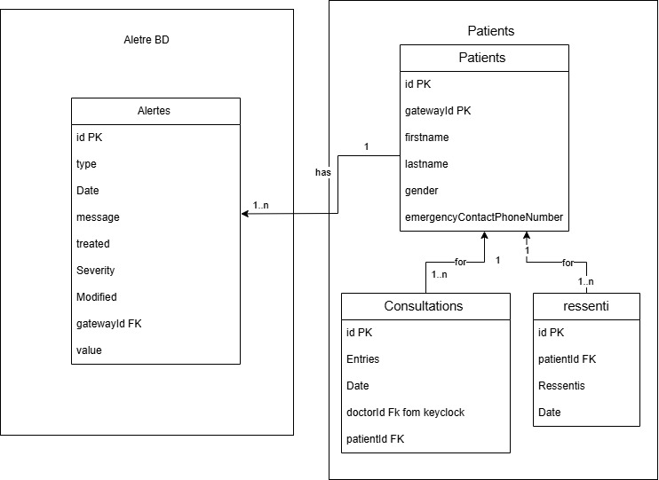

# Modèles des Données

Dans notre système, la structure des données repose sur deux bases de données principales, chacune jouant un rôle 
essentiel dans la gestion des informations critiques : l'une dédiée aux alertes et l'autre aux données des patients.

## Base de données des alertes
Cette base est destinée à stocker des informations détaillées pour chaque alerte émise par le système. 
Chaque enregistrement d'alerte contient les champs suivants :

- **id** : Un identifiant unique, généré automatiquement pour chaque alerte.
- **Date** : Enregistre la date et l’heure de la détection de l'alerte.
- **Type** : Identifie le déclencheur de l'alerte (par exemple, température, accélération, rythme cardiaque, ou taux de glucose).
- **Message** : Fournit une description de l'alerte.
- **gatewayId** : Permet d’associer l’alerte à un utilisateur spécifique.
- **Treated** : Indique si l’alerte a été traitée.
- **Modified** : Enregistre si l’alerte a été modifiée après sa création.
- **Value** : Indique la valeur qui a déclenché l'alerte.
- **Severity** : Définit la gravité de l'alerte.

## Base de données des patients
Cette base contient plusieurs collections, chacune dédiée à un aspect des informations du patient.

### Dossiers patients
Chaque dossier regroupe les informations personnelles de chaque patient :

- **id** : Un identifiant unique, généré automatiquement pour chaque patient.
- **firstname** : Le prénom du patient.
- **lastname** : Le nom de famille du patient.
- **gender** : Le sexe du patient.
- **emergencyContactPhoneNumber** : Le numéro de téléphone d'un contact d'urgence.
- **gatewayId** : Identifiant qui lie les informations du patient aux alertes qui le concernent.

### Consultations des patients
Cette collection enregistre les informations relatives aux consultations médicales de chaque patient :

- **id** : Un identifiant unique, généré automatiquement pour chaque consultation.
- **Date** : La date de la consultation.
- **Entries** : Liste d'entrées, où chaque entrée contient un nom, une valeur, et une remarque pour 
documenter les observations faites lors de la consultation.
- **doctorId** : Identifiant du médecin ayant effectué la consultation.
- **patientId** : Identifiant du patient concerné par la consultation.

### Ressentis des patients
Cette collection enregistre les ressentis des patients, ajoutés manuellement via l'interface frontend :

- **id** : Un identifiant unique, généré automatiquement pour chaque ressenti.
- **Date** : La date à laquelle le ressenti a été enregistré.
- **Ressentis** : Description des symptômes ou sensations ressentis par le patient.
- **patientId** : Identifiant du patient ayant enregistré le ressenti.

