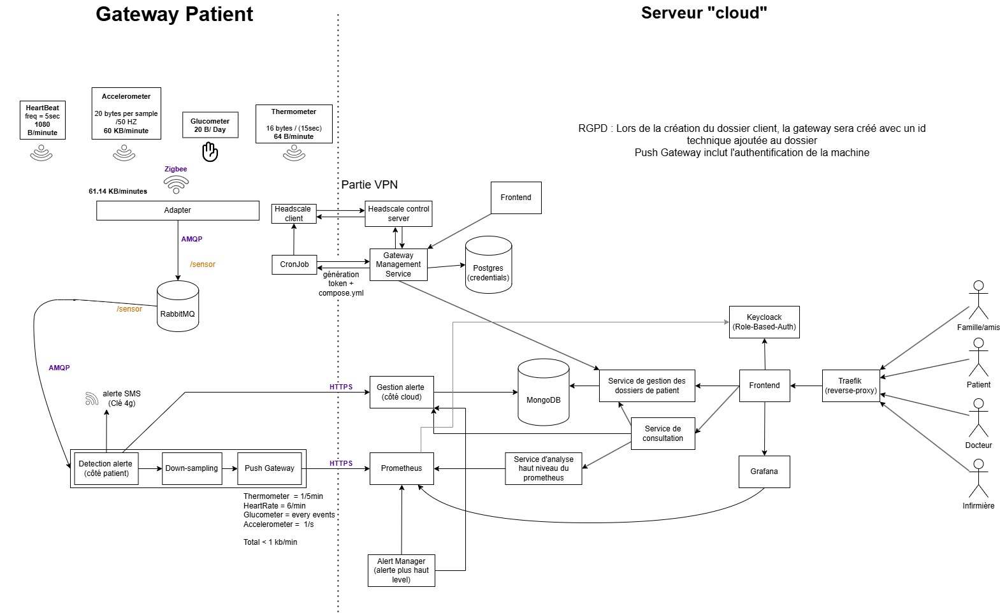

# Fonctionnement du Système

Le système de surveillance des patients repose sur une architecture modulaire et dynamique, permettant de collecter, 
analyser et afficher des données critiques pour assurer un suivi médical efficace et en temps réel. 
Ce choix d’architecture modulaire favorise une séparation claire des fonctionnalités, facilitant ainsi la maintenance et 
l’évolution du système en répartissant les responsabilités par module. En outre, cette approche rend le système hautement scalable, 
permettant d’ajouter facilement de nouvelles fonctionnalités ou d’augmenter la capacité de traitement sans affecter les autres composants.

## Phase 1 : Collecte des Données des Capteurs
Le système commence par la collecte de données provenant de divers capteurs, tels que le cardiofréquencemètre,
l'accéléromètre, le thermomètre et le glucomètre, qui mesurent les signes vitaux du patient à des fréquences variées. 
Ces capteurs transmettent leurs données via la technologie Zigbee à la gateway placé chez le client. Une fois les données arrivées 
dans la gateway, elles sont envoyées vers un broker (RabbitMQ), qui la sauvegarde des donnée dans la gateway en attendant la transmission au serveur, il garantit une transmission fiable des données.

## Phase 2 : Système de Détection d'Alerte Urgente
Le système de détection d'alerte, situé côté patient, surveille en temps réel les données provenant des files de chaque 
capteur via RabbitMQ. Ce système est conçu pour détecter toute situation d'urgence nécessitant une intervention rapide. 
Lorsqu'un état critique est identifié, un SMS est envoyé au proche.

Pour s'assurer que le numéro de contact est valide, le système tente d'abord de récupérer le numéro de téléphone 
associé à l'ID de la gateway depuis le Dossier Patient via un appel au service de gestion du Dossier Patient. 
Si cette récupération échoue, un numéro localement enregistré est utilisé par défaut, garantissant ainsi qu'une alerte
soit envoyée, même en cas d'indisponibilité temporaire du service de gestion des dossiers.

Parallèlement, une alerte est automatiquement enregistrée dans la base de données AlerteDB via le service Gestion Alerte,
ce qui permet de documenter et centraliser les événements critiques pour un suivi et une analyse ultérieurs.

## Phase 3 : Downsampling et Communication avec le Cloud
Après la détection des alertes critiques, les données passent à une phase de réduction. La fréquence d'échantillonage est réduite pour correspondre au besoin d'analyse côté serveur. Une fréquence élevée de mesures n'est pas nécessaire une fois la détection d'alertes critiques faite. Les données sont ensuite compactés en batch puis envoyées au serveur.

## Phase 4 : Prometheus pour la Surveillance des Données
Prometheus consomme les données pour les stocker en vue d'analyses ultérieures. Un service d'analyse de haut niveau 
extrait les données de Prometheus pour fournir aux utilisateurs 
des analyses plus détaillées en fonction de leur rôle. De plus, l'intégration 
d'Alert Manager dans ce processus permet d'identifier des anomalies sur des périodes prolongées en générant des alertes 
via le service de gestion des Alertes.

## Phase 5 : Accès des Utilisateurs
Les utilisateurs, qu'il s'agisse de proches, de médecins ou d'infirmières, accèdent à l'interface frontend via Traefik, 
qui sert de reverse proxy pour gérer le trafic et garantir la sécurité des connexions. L’authentification et 
l’autorisation des utilisateurs sont gérées par Keycloak, qui assure un contrôle précis des accès en fonction des rôles,
permettant ainsi de limiter l'accès aux informations sensibles uniquement aux personnes autorisées.

## Phase 6 : Affichage des Données et Alertes via le Frontend
Le frontend affiche les états des patients à l'aide de graphiques générés par Grafana, qui récupère les données stockées
dans Prometheus. Cette visualisation permet aux utilisateurs de suivre facilement l'évolution de la santé des patients 
en temps réel. Les analyses et les alertes provenant du Service d'Analyse de Haut Niveau et du Service Gestion Alerte 
sont accessibles aux utilisateurs autorisés, notamment aux médecins, aux infirmières et aux proches des patients.

Grâce à ce frontend, les médecins peuvent créer des dossiers pour les patients et leur associer un identifiant de 
passerelle (gateway ID). De plus, les médecins et les infirmières ont la possibilité de rédiger des rapports médicaux, 
qui sont ensuite stockés dans la base de données patient. Cette intégration assure une dépendance forte entre les dossiers
et les rapports médicaux, permettant une visualisation cohérente et un accès rapide à l’information cruciale sur la santé des patients.

Le frontend permet également aux patients de participer activement au suivi de leur état de santé en ajoutant leurs 
ressentis directement depuis l'interface. Cette fonctionnalité est rendue possible grâce au microservice Patient, qui 
gère la soumission et le stockage de ces ressentis dans la base de données des patients. Ces ressentis sont accessibles 
aux médecins et aux infirmières dans les dossiers médicaux, contribuant à une prise en charge plus complète et personnalisée des soins.

## Phase 7 : La Partie VPN
Pour assurer la maintenance et la gestion des gateways installées chez les patients, nous utilisons Tailscale, un réseau overlay distribué peer-to-peer. Tailscale, basé sur le protocole WireGuard, permet d’établir une connexion sécurisée et simplifiée aux gateways sans nécessiter de configuration VPN complexe ou de redirection de ports, garantissant ainsi une communication sécurisée entre les appareils.

Les mises à jour logicielles des gateways s’effectuent via un processus de polling utilisant Docker Compose. Chaque gateway est configurée pour interroger régulièrement une API de gestion dédiée, qui indique si des mises à jour de services conteneurisés sont disponibles. Cette API fournit les versions actualisées des fichiers Docker Compose, permettant ainsi de télécharger et de redéployer les services en fonction des nouvelles configurations.

Cette méthode de mise à jour par polling offre plusieurs avantages :

- Mises à jour automatisées : Les services conteneurisés sur les gateways peuvent être mis à jour sans intervention manuelle, garantissant la continuité des correctifs de sécurité et des nouvelles fonctionnalités.

- Fiabilité accrue : En récupérant les nouvelles configurations depuis une API centrale, chaque gateway est assurée de rester synchronisée avec les mises à jour nécessaires.

- Gestion centralisée : L’API de gestion fournit une visibilité globale sur l’état des versions et des configurations, facilitant le suivi et la maintenance de l’ensemble des gateways.

En combinant Tailscale pour un accès direct et un système de mise à jour via Docker Compose et polling, cette architecture garantit un support continu et sécurisé pour la maintenance à distance des gateways, assurant ainsi la fiabilité et l’évolution du système en temps réel.
